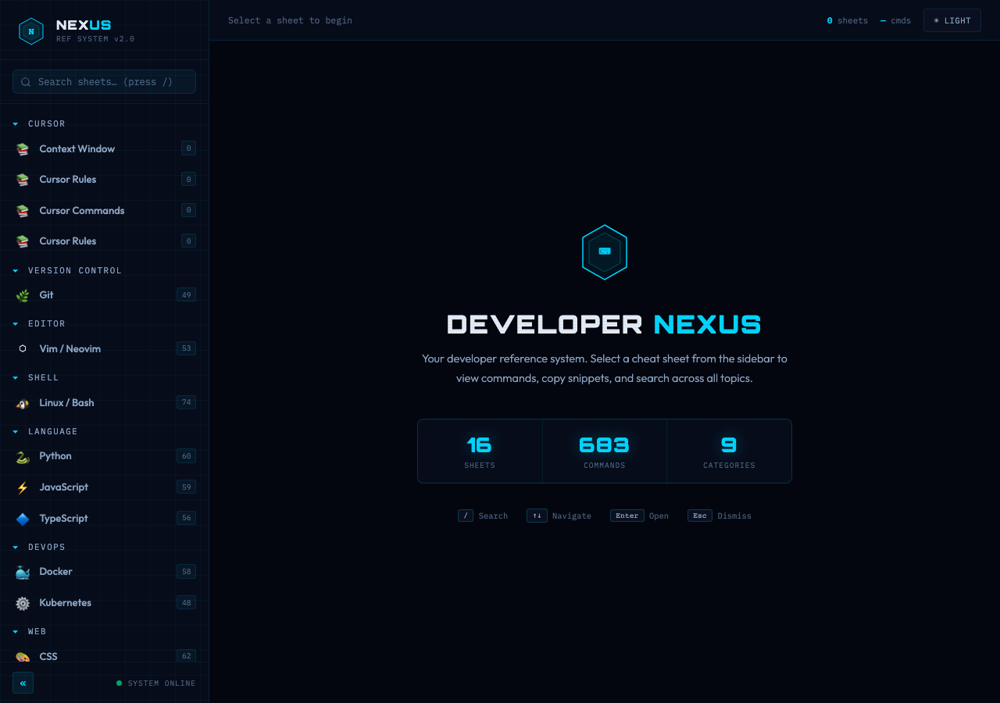
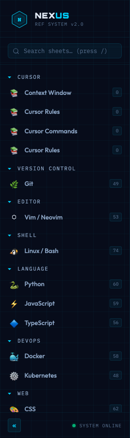
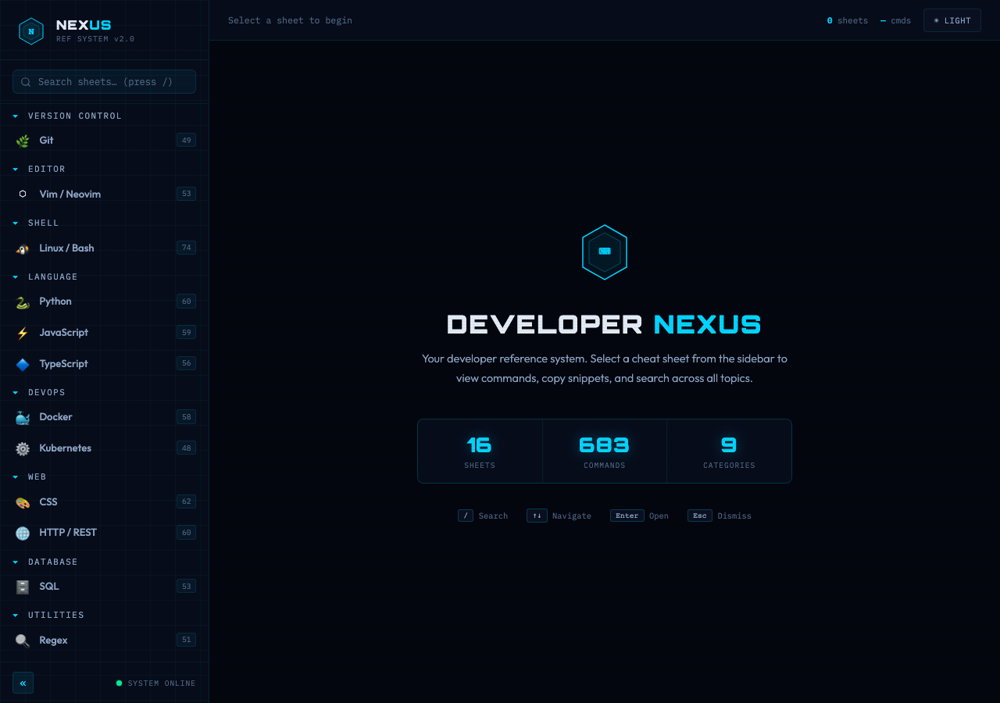
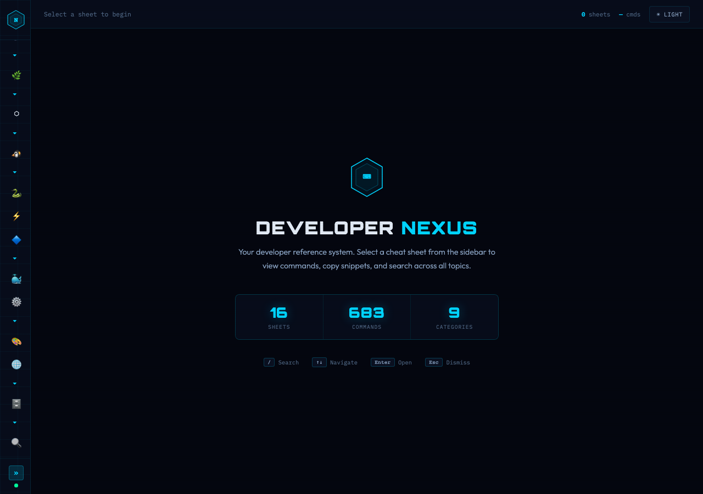
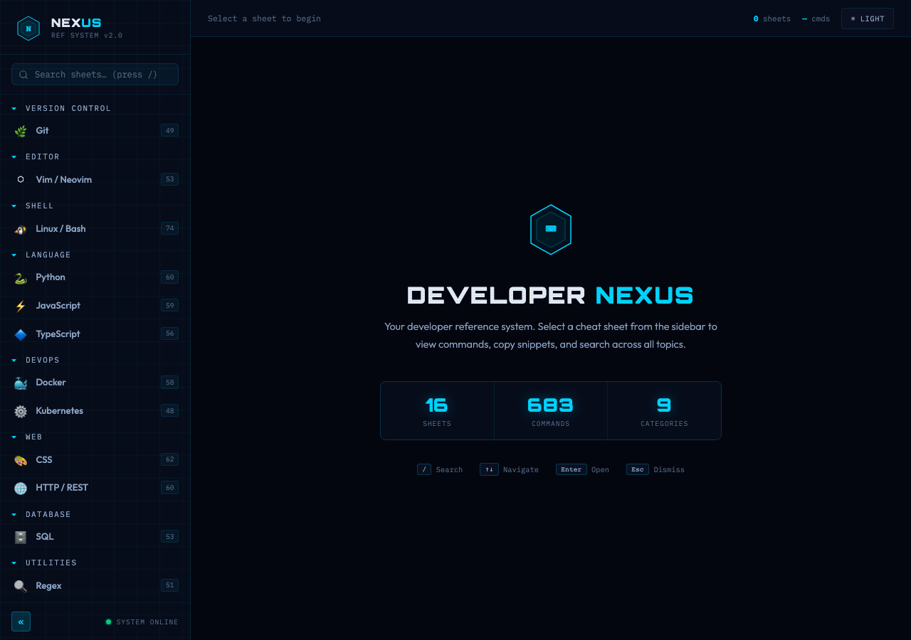

# AI Skills Lab

A hands-on learning environment for practicing AI-assisted software development, featuring **Nexus Ref** — a production-ready developer reference system with a cyberpunk terminal aesthetic.



## What's Inside

### Nexus Ref — Developer Reference System

A zero-dependency, single-page cheat sheet platform built with vanilla HTML, CSS, and JavaScript. Browse 16 reference sheets across 9 categories — from Git and Docker to Python, SQL, and Regex — with instant search, keyboard navigation, and one-click copy.

**Sidebar Navigation** — All categories and sheets organized in a collapsible, scrollable sidebar with command counts per sheet.

<p align="center">
  
</p>

**Scrollable Categories** — Scroll to access all 9 categories: Cursor, Version Control, Editor, Shell, Language, DevOps, Web, Database, and Utilities.



**Minimized Mode** — Collapse the sidebar to icons only for a wider content area.



**Expanded Mode** — Expand back to full labels with all sheets visible.



### Key Features

- **16 cheat sheets** with 683+ commands across 9 categories
- **Instant search** — press `/` to filter sheets by title, category, or tag
- **Keyboard navigation** — arrow keys to browse, Enter to open, Esc to dismiss
- **One-click copy** for individual commands or entire sheets
- **Dark / Light themes** with a cyberpunk terminal aesthetic
- **Resizable sidebar** — drag to adjust width, minimize to icons
- **Collapsible categories** — click any category header to toggle
- **Lazy loading** — sheet data fetched on demand with in-memory caching
- **Zero dependencies** — pure HTML, CSS, and vanilla JavaScript
- **Static hosting ready** — deploy to GitHub Pages, Netlify, or any static host

## Quick Start

```bash
# Clone the repo
git clone <repo-url>
cd ai-skills-lab

# Serve locally (requires HTTP server for fetch() calls)
cd nexus-ref
python3 -m http.server 8080

# Or with Node.js
npx serve .
```

Then open **http://localhost:8080** in your browser.

## Project Structure

```
ai-skills-lab/
├── nexus-ref/                  # Developer reference system
│   ├── index.html              # App shell
│   ├── assets/
│   │   ├── styles.css          # Design system (CSS custom properties)
│   │   └── app.js              # Application logic (vanilla JS)
│   ├── data/
│   │   ├── index.json          # Sheet manifest (metadata)
│   │   ├── version-control/    # Git
│   │   ├── editor/             # Vim
│   │   ├── shell/              # Linux/Bash
│   │   ├── language/           # Python, JavaScript, TypeScript
│   │   ├── devops/             # Docker, Kubernetes
│   │   ├── web/                # CSS, HTTP/REST
│   │   ├── database/           # SQL
│   │   └── utilities/          # Regex
│   └── README.md               # Nexus Ref detailed docs
└── docs/
    └── screenshots/            # UI screenshots
```

## Adding a Cheat Sheet

1. Create `nexus-ref/data/<category>/<topic>.json` following the schema
2. Add an entry to `nexus-ref/data/index.json`

The app picks it up automatically. See [`nexus-ref/README.md`](nexus-ref/README.md) for the full schema and examples.

## License

MIT
