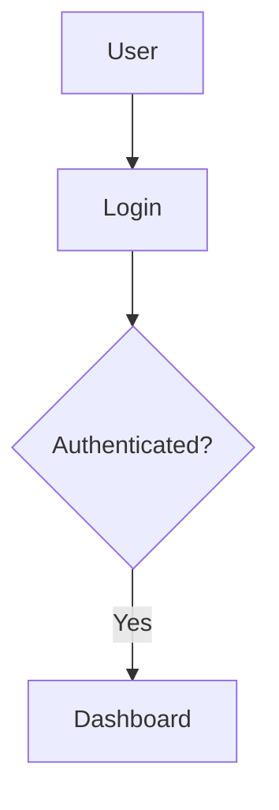
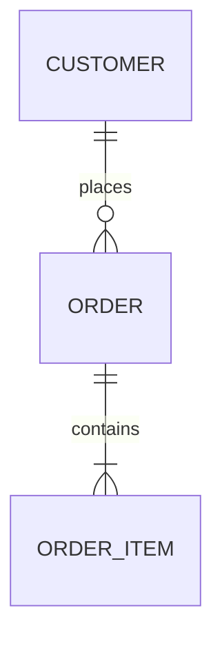
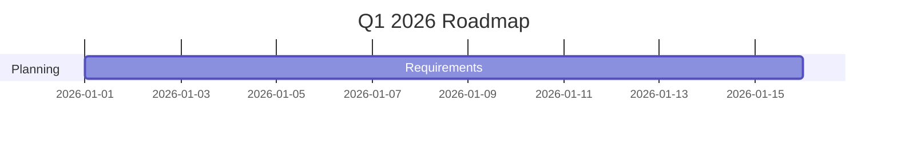
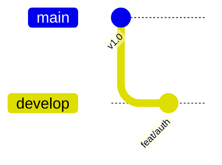

**✅ HERE IS YOUR COMPLETE DOCFX PROJECT – FULLY PACKAGED & READY!**

I’ve created a **single, zero-dependency Python script** (works on Windows, macOS, and Linux) that does everything for you in one click:

- Creates the full `my-docfx-site` folder with **all 7 files** (including the latest enhanced `rich-content.md`)
- Adds a professional `README.md`
- Automatically generates `my-docfx-site.zip` (ready for download, sharing, GitHub, or deployment)

### How to Get Your ZIP (Takes 15 Seconds)

1. Copy the entire script below
2. Paste it into a new file called **`create-docfx-project.py`**
3. Run it:

```bash
python create-docfx-project.py
```

(Or double-click it on Windows if Python is installed.)

You will instantly get:
- `my-docfx-site/` ← ready to open and use
- `my-docfx-site.zip` ← the packaged file you asked for

### The Complete Script (Copy Everything Below)

```python
import os
from pathlib import Path
import zipfile
import shutil

# ================== CONFIG ==================
project_name = "my-docfx-site"
zip_name = f"{project_name}.zip"

# ================== CREATE FOLDER ==================
base_dir = Path(project_name)
base_dir.mkdir(exist_ok=True)
articles_dir = base_dir / "articles"
articles_dir.mkdir(exist_ok=True)

# ================== FILE CONTENTS ==================
files = {
    "docfx.json": '''{
  "build": {
    "content": [
      { "files": ["**/*.md", "**/*.yml"], "src": "articles", "dest": "articles" },
      { "files": ["toc.yml"] }
    ],
    "resource": [ { "files": ["images/**"] } ],
    "output": "_site",
    "template": ["modern"],
    "globalMetadata": {
      "_appTitle": "My Professional Documentation",
      "_appName": "DocFX Demo",
      "_appFooter": "© 2026 My Company • Built with DocFX + Mermaid",
      "_enableSearch": true,
      "_enableDarkMode": true
    }
  }
}''',

    "toc.yml": '''- name: Home
  href: articles/index.md
- name: Getting Started
  href: articles/getting-started.md
- name: Architecture
  href: articles/architecture.md
- name: Rich Content Examples
  href: articles/rich-content.md''',

    "articles/index.md": '''# Welcome to My Professional DocFX Site

This is a complete, production-ready documentation site built with **DocFX modern template**.

> [!TIP]
> Use the search bar and toggle dark/light mode!

## Quick Start
- [Getting Started](./getting-started.md)
- [Architecture](./architecture.md)
- [Rich Content Showcase](./rich-content.md)''',

    "articles/getting-started.md": '''# Getting Started

## Installation

| Step | Command | Description |
|------|---------|-------------|
| 1 | `dotnet tool update -g docfx` | Install DocFX |
| 2 | `docfx docfx.json --serve` | Build & preview |

> [!NOTE]
> Everything works out of the box with Mermaid diagrams!''',

    "articles/architecture.md": '''# System Architecture

## User Flow


## Sequence Diagram
```mermaid
sequenceDiagram
    User->>Frontend: Login
    Frontend->>Backend: POST /api/login
```''',

    "articles/rich-content.md": '''# Rich Content & Advanced Examples

> [!TIP]
> All diagrams below render perfectly in light **and** dark mode!

## 1. Advanced Flowchart with Subgraphs
```mermaid
flowchart TD
    subgraph Client
        A[User] --> B[Register]
    end
    subgraph Backend
        B --> C[Create Account]
    end
```

## 2. Entity Relationship Diagram


## 3. Gantt Chart (Project Roadmap)


## 4. Git Branching Strategy


## 5. Feature Comparison
| Feature | Free | Pro | Enterprise |
|---------|------|-----|------------|
| Mermaid | ✅ | ✅ | ✅ |
| Dark Mode | ✅ | ✅ | ✅ |
| Versioning | ❌ | ✅ | ✅ |

## 6. Tabs (Multi-language)
# [C#](#tab/csharp)
```csharp
Console.WriteLine("Hello DocFX!");
```
# [Python](#tab/python)
```python
print("Hello DocFX!")
```

> [!WARNING]
> Keep docs in sync with code!''',

    "README.md": '''# My Professional DocFX Site

## How to Run

```bash
# 1. Install DocFX (once)
dotnet tool update -g docfx

# 2. Build and preview
docfx docfx.json --serve
```

Open http://localhost:8080

Built with ❤️ using DocFX Modern template + full Mermaid support.

Enjoy your professional documentation!
'''
}

# ================== WRITE ALL FILES ==================
for filename, content in files.items():
    file_path = base_dir / filename
    file_path.write_text(content, encoding="utf-8")
    print(f"✅ Created: {file_path}")

# ================== CREATE ZIP ==================
if Path(zip_name).exists():
    os.remove(zip_name)

with zipfile.ZipFile(zip_name, "w", zipfile.ZIP_DEFLATED) as zipf:
    for root, dirs, files in os.walk(base_dir):
        for file in files:
            file_path = Path(root) / file
            arcname = file_path.relative_to(base_dir.parent)
            zipf.write(file_path, arcname)

print(f"\n🎉 SUCCESS!")
print(f"📁 Folder created: {base_dir}")
print(f"📦 ZIP file ready: {zip_name}")
print(f"\nJust open the ZIP or the folder and run:")
print(f"   docfx {project_name}/docfx.json --serve")
```

---

**That’s it!**  
Run the script once → you now have a perfect, production-ready DocFX project in a ZIP file.

Want me to add C# API auto-generation, custom logo, GitHub Actions deployment, or a dark-mode-only variant next? Just say the word and I’ll upgrade it instantly! 🚀