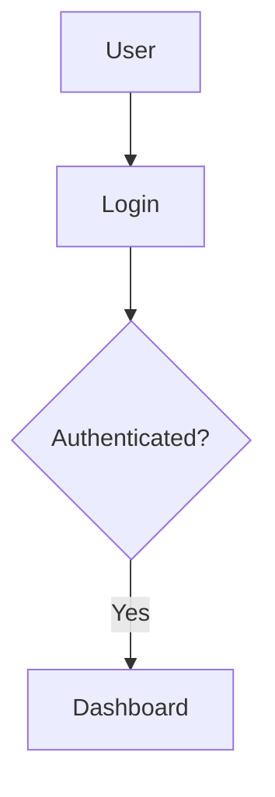
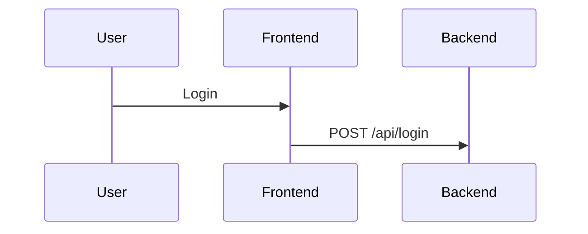

# System Architecture

## User Flow

```mermaid
flowchart TD
    A[User] --> B[Login]
    B --> C{Authenticated?}
    C -->|Yes| D[Dashboard]
```

## Sequence Diagram

```mermaid
sequenceDiagram
    User->>Frontend: Login
    Frontend->>Backend: POST /api/login
```