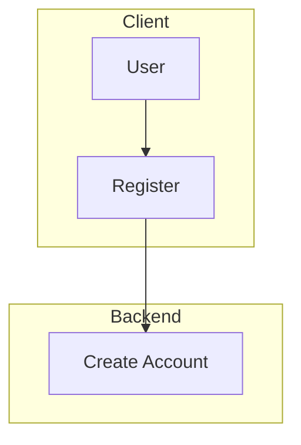
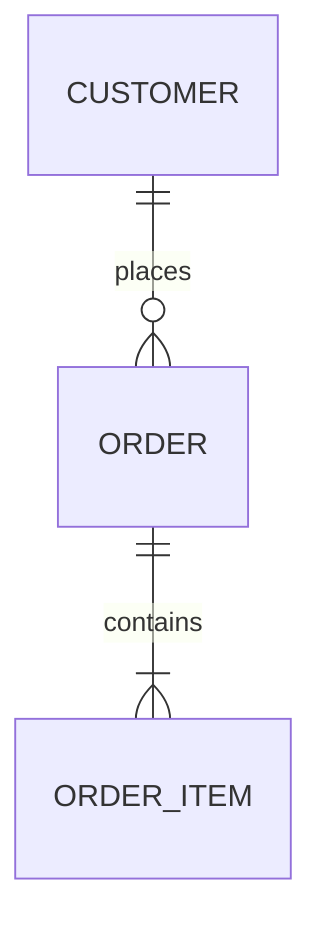
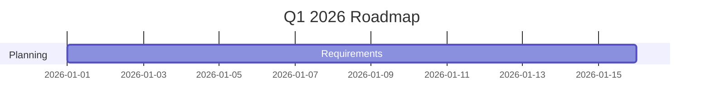
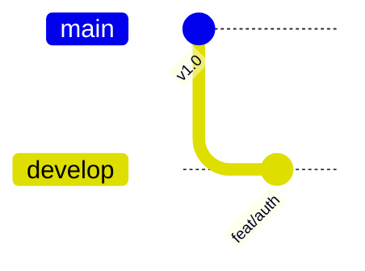

# Rich Content & Advanced Examples

> [!TIP]
> All diagrams below render perfectly in light **and** dark mode!

## 1. Advanced Flowchart with Subgraphs


## 2. Entity Relationship Diagram


## 3. Gantt Chart (Project Roadmap)


## 4. Git Branching Strategy


## 5. Feature Comparison
| Feature | Free | Pro | Enterprise |
|---------|------|-----|------------|
| Mermaid | ✅ | ✅ | ✅ |
| Dark Mode | ✅ | ✅ | ✅ |
| Versioning | ❌ | ✅ | ✅ |

## 6. Tabs (Multi-language)
# [C#](#tab/csharp)
```csharp
Console.WriteLine("Hello DocFX!");
```
# [Python](#tab/python)
```python
print("Hello DocFX!")
```

> [!WARNING]
> Keep docs in sync with code!